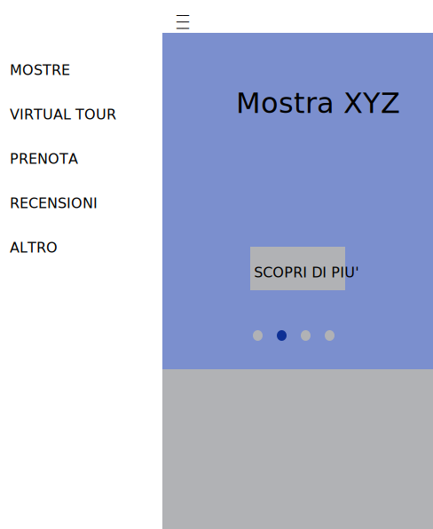

# Struttura sito
 - **home page con menu (probabilmente non va bene il carosello, sarà da sostituire con la prossima mostra)**: mostrerà la prossima mostra in ordine di tempo con un'immagine associata magari e la possibilità di prenotare un biglietto. Insieme alla home page vanno sviluppati header, footer e nav. Bisogna prevedere che se l'utente non loggato clicca prova ad accedere ad una funzionalità per cui occorre essere registrati, si apra un modal che impedisce l'accesso e chiede di registrarsi

 

- **pagina di registrazione**: semplice form con nome, cognome, email e password

 

- **pagina di virtual tour**: avere una mappa della mostra interattiva ove si può cliccare per avere più specifiche delle varie opere, poi potenzialmente ogni stanza e forse ogni opera avrà una pagina. Per effettuare il tour virtuale bisogna essere registrato.

 

- **pagina dettaglio opera**: descrizione di un'opera specifica o di una stanza
- **pagina per prenotazione biglietto**: fa scegliere una data e guarda nel db se ce effettiva disponibilità solo per utenti registrati
- **pagina per recensioni**: solo gli utenti registrati possono lasciare recensioni, ma tutti possono vederle
- **pagina per le mostre**: le mostre verranno ospitate in un piano del museo e non saranno visibili nel tour online, per quanto riguarda la gestione delle prenotazioni dei biglietti per le visite fisiche, esse non tengono conto delle mostre
- **area personale**: ogni utente vede le proprie prenotazioni, l'admin aggiunge e toglie opere e mostre
